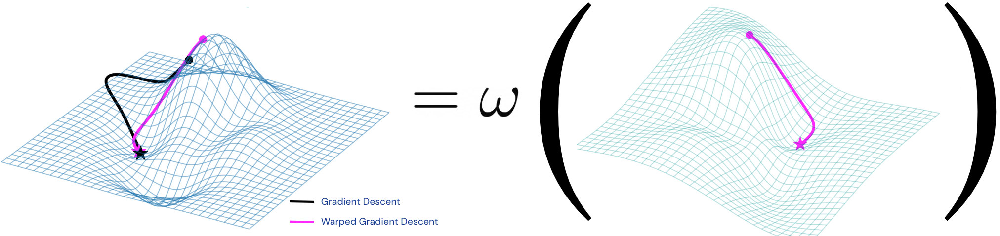
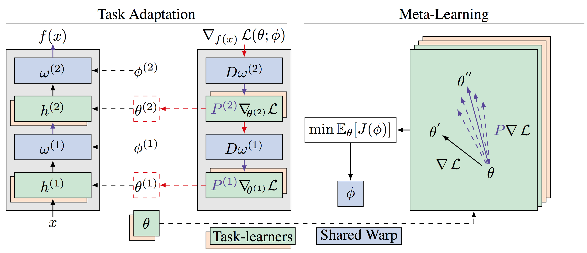

<div align="center">

</div>

## Meta-Learning with Warped Gradient Descent 

[[Paper]](https://openreview.net/forum?id=rkeiQlBFPB) [[Presentation]](https://slideslive.com/38921885/metalearning-4) [[Slides]](http://flennerhag.com/research/pres_warped_gradient_descent_neurips.pdf) 

Original [PyTorch](https://pytorch.org/) implementation of Meta-Learning With Warped Gradient Descent. This repo is built on top
of the [Leap](https://arxiv.org/abs/1812.01054) source [code](https://github.com/amzn/metalearn-leap) and can be used to 
replicate experiments on Omniglot. 

In Warped Gradient Descent, we interleave *warp-layers* between adaptable
layers. Warp-layers are shared across tasks and held fixed during adaption, 
they are instead meta-learned to yield effective parameter updates across all
tasks and steps of adaptation.

<div align="center">

</div>

## License

This library is licensed under the Apache 2.0 License.

## Installation

This repository was developed against PyTorch>1.0 and Python 3.7.
To install only `WarpGrad`: 

```bash
git clone https://github.com/flennerhag/warpgrad
cd warpgrad/src/warpgrad
pip install -e .
```

This package currently contains Algorithm 2 of the main paper. 
To install all models in this repo:

```bash
bash make_omniglot.sh -p
```

## Usage

The API is meant to be domain agnostic in order for you to do what you
want to do. However, it is not meant to be a final package but a starting point
for you to use when developing your own gradient warping setup. At a high level
we create a model where some modules are treated as task-adaptable and some
modules are treated as warp-layers. In the simplest case, we interleave them.
A mock example could look like this:

```python
warp_layer_idx = range(0, num_layers, 2)
task_layer_idx = range(1, num_layers+1, 2)
layers = [Linear(hidden_size, hidden_size) for _ in range(num_layers)]
model = Sequential(*layers)
warp_layers = [layers[i] for i in warp_layer_idx]
task_layers = [layers[i] for i in task_layer_idx]
```

Next, we need meta-objective for the warp-layers, for instance one of 
Algorithms 1 to 3 in the main paper. This code base implements Algorithm 2. To
define the meta-loss, we (a) create an instance by specifying the loss
criterion (and some optional arguments) and (b) a parameter replay strategy.

```python
updater = warpgrad.DualUpdater(criterion=CrossEntropyLoss)
buffer = warpgrad.ReplayBuffer()
```

With these objects, we create a `Warp` instance that we can treat as our normal
model. This model has ``task_parameters`` and ``warp_parameters`` methods that
we can use to initialise separate optimisers.

```python
model = warpgrad.Warp(model,          # The full model
                      adapt_layers,   # List of nn.Modules for adaptation
                      warp_layers,    # List of nn.Modules for warping
                      updater,        # The meta-objective
                      replay_buffer)  # Meta-objective parameter replay

meta_opt = meta_opt_class(model.warp_parameters(), **meta_opt_kwargs)
```

We tune ``adapt_parameters`` to calling ``model.init_adaptation``
and creating an optimiser for ``adapt_parameters`` that we train under. For
instance,

```python
model.init_adaptation()     # Initialize adaptation on the model side
opt = opt_class(model.adapt_parameters(), **opt_kwargs)

for x, y in task:
    loss = criterion(model(x), y)
    loss.backward()
    opt.step()
    opt.zero_grad()
```

To meta-learn warp-parameters, we collect parameters while running the task
adaptation training loop. In the simplest case, we run N tasks, collect task
parameterisations in the replay buffer, then run the WarpGrad objective over
the buffer. But that's just one way of doing things!

```python

def meta_step_fn():
    meta_opt.step()
    meta_opt.zero_grad()

for meta_step in range(meta_steps):
    meta_batch = tasks.sample()
    for task in meta_batch:
        model.init_adaptation()     # Initialize adaptation on the model side
        model.register_task(task)   # Register task in replay buffer
        model.collect()             # Turn parameter collection on

        opt = opt_cls(model.adapt_parameters(), **opt_kwargs)

        for x, y in task:
            loss = criterion(model(x), y)
            loss.backward()
            opt.step()
            opt.zero_grad()

        # Evaluation
        model.eval()
        model.no_collect()
        your_evaluation(task, model)
    ###

    # Meta-objective
    model.backward(meta_step_fn)
```


## Details

For a more detailed implementation, see the `omniglot` experiment:
- The [main.py](https://github.com/flennerhag/warpgrad/blob/master/src/omniglot/main.py)
    script gives you an idea of how we train and evaluate models.
- the [wrapper.py](https://github.com/flennerhag/warpgrad/blob/master/src/omniglot/wrapper.py)
    script tells you how inner and outer loops are dealt with.
- the [model.py](https://github.com/flennerhag/warpgrad/blob/master/src/omniglot/model.py)
    script shows you how to build warped models.

Once you've had a look at those, you should go over the `WarpGrad` package:
- The [warpgrad.py](https://github.com/flennerhag/warpgrad/blob/master/src/warpgrad/warpgrad/warpgrad.py)
    module houses the main `Warp` class.
- The [updaters.py](https://github.com/flennerhag/warpgrad/blob/master/src/warpgrad/warpgrad/updaters.py)
    module houses meta-learning objectives.
- The [utils.py](https://github.com/flennerhag/warpgrad/blob/master/src/warpgrad/warpgrad/utils.py)
    module houses meta-learning computations and other helpers.

## Omniglot

To run the Omniglot experiment, first prepare the dataset using the
``make_omniglot.sh`` script in the root directory. The ``p`` flag downloads
the dataset, ``d`` installs dependencies and ``l`` creates log directories.

```bash
bash make_omniglot.sh -pdl
```

To train a meta-learner, use the ``main.py`` script. To replicate experiments
in the paper select a meta learner and number of pretraining tasks.

```bash
python main.py --meta_model warp_leap --suffix myrun
```

Logged results can be inspected and visualised using the
``monitor.FileHandler`` class. For all runtime options see

```bash
python main.py -h
```

We provide command-line flags for varying the expressive capacity of
warp-layers. In particular, we assume interleaved warp-layers that can be
anything from linear to multi-layer convolutional stacks with residual
connections and batch-norm. 

Meta-learners available:

- ``warp`` (requires the ``src/warpgrad`` package)
- ``leap`` (requires the ``src/leap`` package)
- ``reptile``
- ``fomaml`` (first-order MAML)
- ``maml`` (requires the ``src/maml`` package)
- ``ft`` (multi-headed finetuning)
- ``no`` (no meta-training)
